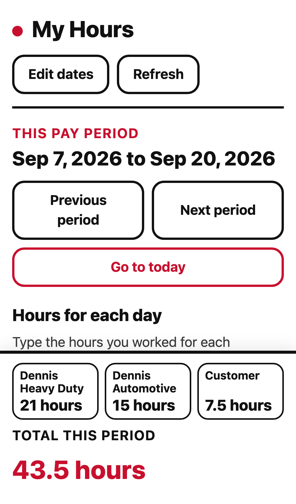
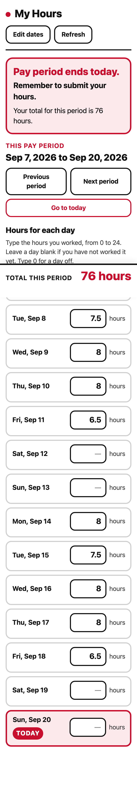

# My Hours

A deliberately simple, private hours tracker for one employee. It is designed for a phone, works
without an account, and keeps its data on that device.

## What it does

- Opens on the phone's current day.
- Shows three hours boxes for every day in the active pay period, one per category: Dennis Heavy
  Duty, Dennis Automotive and Customer, each with an optional note underneath.
- Adds valid entries immediately and keeps each category's total, plus the overall total, visible at
  the bottom.
- Repeats any pay schedule from one known start and end date; 14 days is the default.
- Shows a large “remember to submit” message on the final day.
- Keeps working offline after the first visit and can be installed on iPhone or Android.

There is no employer login, cloud sync, payroll calculation, overtime rule, wage calculation,
tracking, or analytics. The only stored information is the pay schedule, hours and notes entered in the
browser's local storage.

## Screenshots





## Design

The visual language comes from ShopBoard's Classic theme: white ground, black type and rules, and a
restrained red accent. My Hours softens it with rounded cards and controls, 18px minimum text, strong
focus rings, and 52px touch targets. There are no themes or settings menus.

## Development

```sh
npm install
npm run dev
npm test
npm run test:e2e
npm run build
```

The unit suite covers pay-period arithmetic, local dates across time zones and DST, decimal totals,
validation, and corrupt storage. Playwright covers the complete phone flow in Chromium and WebKit,
including hit-testing with `elementFromPoint`, persistence, due-day reminder placement, storage
failure, and an offline reload.

See [PLAN.md](PLAN.md) for the product contract and acceptance gates.
